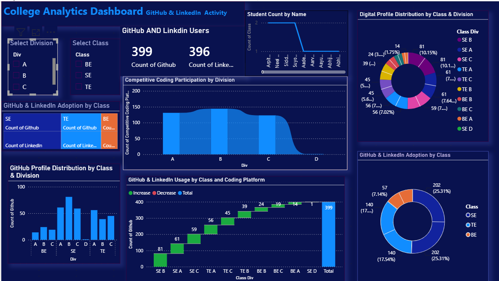

# college-analytics-dashboard

## 📌 Project Overview

This project was developed as part of a college academic assignment to analyze student digital presence and engagement. The objective was to build an interactive Power BI dashboard using student data, including GitHub profiles, LinkedIn profiles, and competitive coding platform participation.

The dashboard provides insights into student distribution across classes and divisions, digital profile adoption, and coding platform participation through interactive visualizations and filters.

## Dashboard Features

- Total Students KPI
- GitHub User Analysis
- LinkedIn User Analysis
- Competitive Coding Participation
- Division-wise Analysis
- Class-wise Analysis
- Interactive Filters
- Professional Dashboard Design

## Tools Used

- Power BI
- Microsoft Excel
- Data Visualization
- Data Analysis

## Dataset

The dataset contains:

- Student Name
- Division
- Class
- GitHub Profile
- LinkedIn Profile
- Competitive Coding Platform

## 📊 Dashboard Preview

The dashboard provides an interactive overview of student analytics, allowing users to explore GitHub, LinkedIn, and competitive coding participation across different classes and divisions.

### Dashboard Screenshot

## Project Structure

Dashboard/
Dataset/
Screenshots/
Documentation/

## Author

Santoshi Pandalwad
